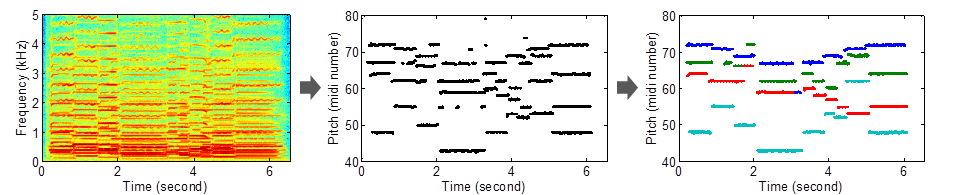
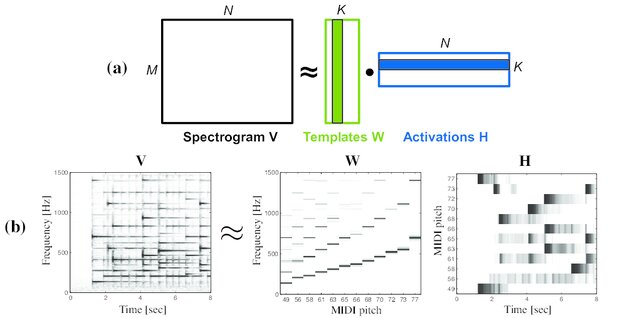

# Multi-Pitch Estimation with Nonnegative Matrix Factorization

In this project we will examine how NMF (and potentially deep NMF) can be used for multi-pitch estimation. This approach is inspired by traditional MPE methods with the goal of examining a more lightweight and interpretable approach of MPE. This could be potentially expanded towards a fully unsupervised or self-supervised method in the future. 

## Multi-pitch Estimation (MPE)

[Multi-pitch estimation](https://music-ir.org/mirex/wiki/2020:Multiple_Fundamental_Frequency_Estimation_%26_Tracking) is the process of retrieving the active notes at any given point for a given audio signal. Given an input spectrogram $X$ representing a piece of audio containing a musical piece, an MPE model would predict $Y$, the frame-level activations of notes in that piece of audio.

Such predictions are useful for general music information retrieval tasks, such as automatic chord estimation, automatic music transcription, genre classification etc.

Multi-pitch estimation has been mostly tackled with supervised methods. Most SOTA methods include CNN and Transformer networks, which handle both the temporal and spectral relationships between notes ([Bittner et al., 2022](https://arxiv.org/abs/2203.09893)),([Toyama et al., 2023](https://arxiv.org/abs/2307.04305)). However, such methods require enormous amounts of labeled data, which is incredibly expensive to develop for music information retrieval tasks. Therefore, recent methods have attempted to approach MPE in an unsupervised or self-supervised way ([Cwitkowitz et al., 2024](https://arxiv.org/abs/2402.15569)), but with little success.

## Nonnegative Matrix Factorization (NMF)

[Nonnegative matrix factorization](https://en.wikipedia.org/wiki/Non-negative_matrix_factorization) is a mathematical technique which decomposes a matrix $X$ into two nonnegative components, $W$ and $H$.

NMF has been used for deep learning tasks where the data can be  inherently decomposed into fundamental structures. During approximation, the marices $W$ and $H$ are approximated using by minimizing the following term as a reconstruction loss:

$$
    \Vert X - WH \Vert _F
$$

This way, we can define $W$ as a learnable dictionary, and $H$ as the activation coefficients of $W$. The goal of NMF in machine learning is to create a highly interpretable, lighteweight representation of our data. 

### Deep NMF

Deep NMF expands uppon the method of NMF by applying $L$ layers of decomposition to the composite matrices:

$$
    X \approx W_1 H_1 \\
    W_1 \approx W_2 H_2 \\
    \vdots \\
    W_L \approx W_L H_L
$$

This approach allows the dictionary and/or coefficient matrices to overcome depth and optimization limitations for better approximation of our data. The proposed training objective in this case is the following ([Gillis et al., 2022](https://arxiv.org/abs/2206.10693)):

$$  
    \frac{1}{2} \left( \Vert X-W_1H_1 \Vert_F^2+\lambda_1\Vert W_1-W_2H_2\Vert_F^2 + \dots+ \lambda_1\Vert W_{L-1}-W_LH_L\Vert_F^2 \right)
$$

It is worth noting that both NMF and deep NMF are largely influenced by the initialization of $W$ and $H$, as well as the training objective function. The above objective is crucial to stabilize optimization and enforce rigid global reconstruction.

### NMF in MPE

NMF has been traditionally used in MPE and other MIR tasks. In such approaches, $W$ is the harmonic profile of each note and $H$ represents the activations of such notes. 

NMF is by default an unsupervised process. However, supervised objectives can be used to influence the initialization and form of the component matrices. Specifically, by encouraging similarity between the activation coefficients $H$ and the frame-level notes, we can enforce the dictionary $W$ to mimic the harmonic profile of each note, thus allowing both cleaner reconstruction and generalization. 

**The objectives of this project are:**

* Create a dictionary matrix $W$ by minimizing:

$$
    \Vert X - WH \Vert_F
$$

where $X$ is our input spectrogram and $H = Y$ is equal to the note activation posteriorgram.

* Use $W$ to approximate $Y$ for new, unseen samples.
* Evaluate this strategy on a simple dataset ([Guitarset](https://guitarset.weebly.com/)) as well as a complex one ([MAESTRO](https://magenta.withgoogle.com/datasets/maestro))
* **IF I HAVE ENOUGH TIME** expand the methodology to a Deep NMF which expands uppon the activation coefficients. 